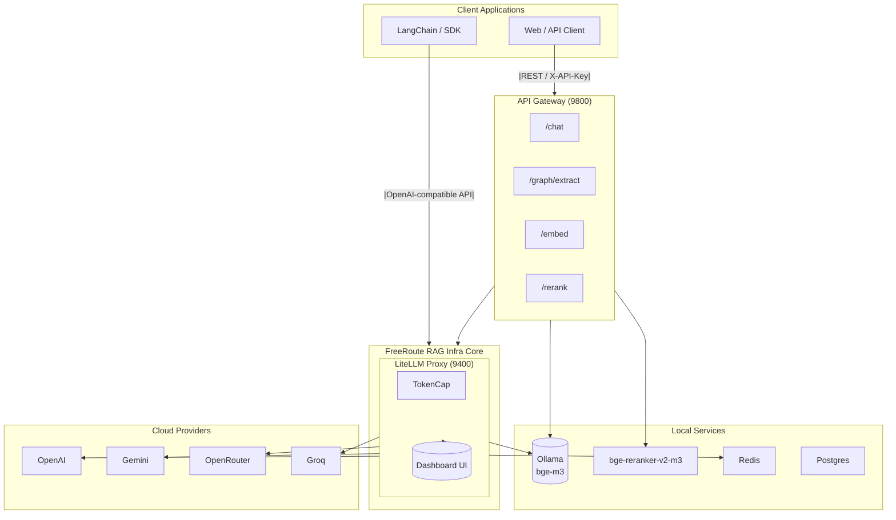

# FreeRoute RAG Infra

<div align="right">
  <sup>Languages:</sup>
  <a href="README.md">English</a> |
  <a href="README.zh-TW.md">繁體中文</a>

</div>

Zero-Cost RAG/GraphRAG Infrastructure — LangChain Compatible

<!-- Badges -->
[](https://github.com/tc3oliver/FreeRoute-RAG-Infra/actions/workflows/ci.yml)
[](LICENSE)


## Overview

FreeRoute RAG Infra is a locally deployable RAG/GraphRAG infrastructure designed to help developers build and test with zero cost whenever possible (Free-first). It prioritizes free or low-cost providers, falls back when quotas are hit, and includes local components.

Highlights:

- Free-first routing: Prefer free or low-cost providers. When OpenAI hits daily token caps (TPD) or errors occur, automatically reroute to Gemini / Groq / OpenRouter. Local embeddings via Ollama.
- Standard interfaces: LiteLLM exposes OpenAI-compatible endpoints (for LangChain/SDK). API Gateway provides /chat, /embed, /rerank, /graph/extract.
- Local capabilities: Embeddings via Ollama (bge-m3), reranking via bge-reranker-v2-m3, optional GPU.
- Observability & governance: TokenCap (daily OpenAI token limits and accounting), Redis, Dashboard UI.
- GraphRAG: Extraction plus JSON Schema validation/repair. Structure maps cleanly to Neo4j/GraphDB style.

Use cases: Individual/team Dev/Test, private LLM API proxy, workshops/courses, RAG/GraphRAG PoC.

## Table of contents

- [Overview](#overview)
- [Architecture](#architecture)
- [Features](#features)
- [Requirements](#requirements)
- [Quick start](#quick-start)
- [Configuration](#configuration)
- [Services and ports](#services-and-ports)
- [Free tiers and sources](#free-tiers-and-sources)
- [Model entrypoints and routing](#model-entrypoints-and-routing)
- [API](#api)
- [Graph Schema](#graph-schema)
- [Reranker and embeddings](#reranker-and-embeddings)
- [Testing](#testing)
- [Troubleshooting](#troubleshooting)
- [Project structure](#project-structure)
- [License](#license)

## Architecture



Note: LangChain is recommended to connect directly to LiteLLM (9400). Application flows for end users can go through the API Gateway (9800).

## Features

- OpenAI-compatible API (LiteLLM proxy)
- API Gateway: /chat, /embed, /rerank, /graph/extract
- Local embeddings: Ollama bge-m3
- Local reranker: BAAI/bge-reranker-v2-m3 (GPU optional)
- TokenCap: Daily OpenAI token caps and cost-aware rerouting
- Dashboard UI: Requests, errors, and usage

## Requirements

- Docker 24+ (Compose v2)
- Optional GPU: NVIDIA driver + Container Toolkit (Linux recommended CUDA 12.x)

## Quick start

1) Create .env

```bash
# .env (example)
OPENAI_API_KEY=...
GOOGLE_API_KEY=...
OPENROUTER_API_KEY=...
GROQ_API_KEY=...
# Optional: API_GATEWAY_KEYS=dev-key,another-key
```

2) Start

```bash
docker compose up -d --build
```

3) Health checks

```bash
curl -s http://localhost:9400/health || curl -s http://localhost:9400/health/readiness | jq
curl -s http://localhost:9800/health | jq
```

4) Dashboard

-- URL: http://localhost:9400/ui
- Default credentials: admin / admin123 (change ASAP)

First run notes:

- Ollama will pull the bge-m3 model automatically. The reranker downloads BAAI/bge-reranker-v2-m3 on first run; this can take a few minutes.
- Persistent volumes: `ollama_models`, `reranker_models`.

## Configuration

Put configuration in .env. Do not commit .env to version control.

| Variable | Example | Description |
| --- | --- | --- |
| LITELLM_MASTER_KEY | sk-admin | Unified API key for LiteLLM (for LangChain/SDK) |
| OPENAI_API_KEY | sk-... | OpenAI API key (subject to daily token caps) |
| GOOGLE_API_KEY | AIza... | Google Gemini API key |
| OPENROUTER_API_KEY | sk-or-... | OpenRouter API key |
| GROQ_API_KEY | gsk_... | Groq API key |
| OPENAI_TPD_LIMIT | 10000000 | Daily OpenAI token cap (e.g., 10M) |
| OPENAI_REROUTE_REAL | true | Allow rerouting even when calling real OpenAI models directly |
| GRAPH_SCHEMA_PATH | /app/schemas/graph_schema.json | Graph Schema path (shared by TokenCap/Gateway) |
| TZ | Asia/Taipei | Time zone |
| TZ_OFFSET_HOURS | 8 | Time zone offset used for daily counters in Redis |
| API_GATEWAY_KEYS | dev-key,another-key | Allowed X-API-Key list for the Gateway |

API Gateway extras:

- LITELLM_BASE (default http://litellm:4000/v1): Base URL to talk to LiteLLM
- LITELLM_KEY (default sk-admin): Admin key used by the Gateway when calling LiteLLM
- RERANKER_URL (default http://reranker:8080; if unset, app defaults to 80): Reranker URL
- GRAPH_SCHEMA_PATH (default `/app/schemas/graph_schema.json`): Shared Graph Schema (mounted from `./schemas/graph_schema.json`)
- GRAPH_MIN_NODES / GRAPH_MIN_EDGES (default 1 / 1): /graph/extract thresholds
- GRAPH_ALLOW_EMPTY (default false): Allow empty output to pass thresholds
- GRAPH_MAX_ATTEMPTS (default 2): Attempts per provider (strict → nudge)
- GRAPH_PROVIDER_CHAIN (default `graph-extractor,graph-extractor-o1mini,graph-extractor-gemini`): Provider order

Cost protection:

- `litellm.config.yaml` sets `general_settings.max_budget_per_day: 0.0` to avoid unexpected costs.
- TokenCap enforces the daily OpenAI token limit via `OPENAI_TPD_LIMIT`; compose defaults to 9M (reserve ~1M for system).

## Services and ports

| Service | Port | Description |
| --- | ---: | --- |
| LiteLLM Proxy | 9400 | OpenAI-compatible API (for LangChain/SDK) |
| Dashboard UI | 9400 | http://localhost:9400/ui |
| API Gateway | 9800 | /chat /embed /rerank /graph/extract |
| Reranker | 9080 | POST /rerank (bge-reranker-v2-m3) |
| Ollama | 9143 | bge-m3 embeddings |
| Redis | 6379 | Token counters / cache |
| Postgres | 5432 | Internal by default (not exposed) |

## Free tiers and sources

Provider policies and quotas change. Always verify with official pages.

- OpenAI (API)
  - No official “free daily token for data sharing” program. API calls are not used to train by default (you may opt-in for improvement).
  - Free credits depend on promotions, region, and time.
  - References:
    - https://platform.openai.com/docs/billing/overview
    - https://platform.openai.com/docs/guides/rate-limits/usage-tiers

- Google Gemini
  - Free/trial quotas via AI Studio/Developers; varies by model and region.
  - Reference: https://ai.google.dev/pricing

- Groq
  - Free inference API for certain models (e.g., Llama/Mixtral variants), with rate and quota limits.
  - Reference: https://groq.com/pricing

- OpenRouter
  - Aggregates many models; some are tagged free with queue/rate limits.
  - References:
    - https://openrouter.ai/pricing
    - https://openrouter.ai/models?tag=free

- Ollama (local)
  - Local inference, no cloud cost; performance depends on hardware.
  - Reference: https://ollama.com/

Default policy: Prefer free or low-cost providers. When OpenAI hits daily token caps (TPD) or errors occur, automatically reroute to Gemini/Groq/OpenRouter. Local embeddings via Ollama.

## Model entrypoints and routing

Defined in `configs/litellm.config.yaml`.

Chat / inference:

| Entry | Backend | Notes |
| --- | --- | --- |
| rag-answer | OpenAI gpt-5-mini | Default; reroute when capped |
| rag-answer-gemini | Gemini 2.5 Flash | Free fallback |
| rag-answer-openrouter | Mistral Small 24B (free) | OpenRouter fallback |
| rag-answer-groq | Groq Llama/Mixtral | Low-latency fallback |

Graph extraction:

| Entry | Backend | Notes |
| --- | --- | --- |
| graph-extractor | OpenAI mini | Default; TokenCap injects JSON Schema |
| graph-extractor-o1mini | OpenAI o1-mini | Fallback |
| graph-extractor-gemini | Gemini 2.5 Flash | Preferred fallback when capped/failing |

Embeddings / Rerank:

| Entry | Backend | Notes |
| --- | --- | --- |
| local-embed | Ollama bge-m3 | Local, free |
| reranker (Gateway) | bge-reranker-v2-m3 | Self-hosted API; best with GPU |

Routing strategy (TokenCap):

- Daily counter key: `tpd:openai:YYYY-MM-DD`
- Multi-hop fallback:
  - graph-extractor → graph-extractor-gemini
  - rag-answer → rag-answer-gemini → rag-answer-openrouter → rag-answer-groq
- OPENAI_REROUTE_REAL=true: reroute even for real OpenAI model names

## API

LiteLLM (unified API)

- Base URL: `http://localhost:9400/v1`
- Auth: `Authorization: Bearer <LITELLM_MASTER_KEY>`

Example (Python / LangChain):

```python
from langchain_openai import ChatOpenAI, OpenAIEmbeddings

llm = ChatOpenAI(base_url="http://localhost:9400/v1", api_key="sk-admin", model="rag-answer", temperature=0.2)
emb = OpenAIEmbeddings(base_url="http://localhost:9400/v1", api_key="sk-admin", model="local-embed")

print(llm.invoke("Explain RAG in three lines").content)
print(len(emb.embed_query("Key differences between GraphRAG and RAG")))
```

OpenAI-compatible REST:

```bash
curl -s http://localhost:9400/v1/chat/completions \
  -H "Authorization: Bearer sk-admin" \
  -H "Content-Type: application/json" \
  -d '{"model":"rag-answer","messages":[{"role":"user","content":"List three advantages of RAG"}]}'
```

API Gateway (app layer)

- Base: `http://localhost:9800`
- Auth: `X-API-Key: <key>` (default dev-key; set via `API_GATEWAY_KEYS`)

Endpoints:

| Method | Path | Purpose |
| --- | --- | --- |
| GET | /health | Health check |
| GET | /whoami | Config summary (requires key) |
| POST | /chat | Chat / JSON mode (auto system hint) |
| POST | /embed | Embeddings (local-embed) |
| POST | /rerank | Text reranking (bge-reranker-v2-m3) |
| POST | /graph/extract | Graph extraction with Schema validation |

Examples:

```bash
# /chat
curl -s -H "X-API-Key: dev-key" -H "Content-Type: application/json" \
  -d '{"messages":[{"role":"user","content":"Reply in JSON with two bullet points of benefits"}],"json_mode":true,"temperature":0.2}' \
  http://localhost:9800/chat | jq

# /embed
curl -s -H "X-API-Key: dev-key" -H "Content-Type: application/json" \
  -d '{"texts":["What is RAG?","What is GraphRAG?"]}' \
  http://localhost:9800/embed | jq

# /rerank
curl -s -H "X-API-Key: dev-key" -H "Content-Type: application/json" \
  -d '{"query":"What is generative AI?","documents":["AI is artificial intelligence","Generative AI can create content"],"top_n":2}' \
  http://localhost:9800/rerank | jq

# /graph/probe (lightweight probe, no schema validation)
curl -s -H "X-API-Key: dev-key" -H "Content-Type: application/json" \
  -d '{"model":"graph-extractor","strict_json":true}' \
  http://localhost:9800/graph/probe | jq
```

## Graph Schema

- Repo path: `schemas/graph_schema.json`
- Container path: `/app/schemas/graph_schema.json` (mounted via docker-compose)
- Top-level shape:

```json
{
  "nodes": [
    {"id": "string", "type": "string", "props": [{"key": "...", "value": "..."}]}
  ],
  "edges": [
    {"src": "string", "dst": "string", "type": "string", "props": [{"key": "...", "value": "..."}]}
  ]
}
```

Notes: `props[].value` supports string/number/boolean/null.

The Gateway and TokenCap read this file and validate on startup (fail-fast if invalid).

Graph extraction (recommended via Gateway):

```bash
curl -s -H "X-API-Key: dev-key" -H "Content-Type: application/json" \
  -d '{"context":"Alice joined Acme in 2022 as an engineer; Acme HQ is in Taipei, founded by Bob."}' \
  http://localhost:9800/graph/extract | jq
```

Common parameters:

- context (required)
- min_nodes / min_edges (default 1 / 1)
- allow_empty (default false)
- max_attempts (default 2; each provider: strict then nudged)
- provider_chain (optional; override defaults)

## Reranker and embeddings

Embeddings (Ollama bge-m3)

- LiteLLM model name: `local-embed`
- In LangChain, use `OpenAIEmbeddings` pointing to the LiteLLM base URL

Reranker (bge-reranker-v2-m3)

-- Direct endpoint: `POST http://localhost:9080/rerank`
-- Via Gateway: `POST http://localhost:9800/rerank`
- Response: `{"ok": true, "results": [{"index": 1, "score": 0.83, "text": "..."}]}`

## Testing

Run integration tests with pytest (services must be up):

```bash
pytest -q tests/gateway
pytest -q tests/reranker
```

## Troubleshooting

GPU / platform differences:

- `... platform (linux/arm64/v8) does not match (linux/amd64) ...` → pin `platform: linux/amd64` or use a compatible image.
- GPU not detected → install NVIDIA Container Toolkit; verify via `docker run --gpus all nvidia/cuda:12.4.0-base nvidia-smi`.

Env vars not loaded:

- See `WARN The "OPENAI_API_KEY" variable is not set` → check `.env` and `docker compose config` output.

LiteLLM `/usage` 404:

- Newer versions may not expose `/usage`; check the UI or proxy logs instead.

JSON mode issues:

- When calling LiteLLM directly, set `response_format={"type":"json_object"}` and prompt for JSON. Gateway `/chat` with `json_mode=true` injects the hint automatically.

Graph extraction empty/invalid JSON:

- The Gateway attempts to repair/normalize; if still invalid, it returns 422 with attempts included. Ensure `schemas/graph_schema.json` is valid.

OpenAI calls still used after TPD reached:

- Ensure `OPENAI_REROUTE_REAL=true`; check plugin logs for `reroute(hop ...)` messages.

## Project structure

```
.
├─ services/
│  ├─ gateway/               # API Gateway (FastAPI)
│  │  ├─ app.py
│  │  └─ requirements.txt
│  └─ reranker/              # PyTorch Reranker (FastAPI)
│     └─ server.py
├─ integrations/
│  └─ litellm/
│     └─ plugins/
│        └─ token_cap.py     # TokenCap: TPD + reroute + schema injection
├─ containers/
│  ├─ gateway/Dockerfile     # Gateway container
│  └─ litellm/Dockerfile     # LiteLLM container
├─ schemas/
│  └─ graph_schema.json      # Graph JSON Schema (mounted to /app/schemas)
├─ configs/
│  └─ litellm.config.yaml    # LiteLLM models and routing strategy
├─ tests/
│  ├─ gateway/test_gateway.py
│  └─ reranker/test_reranker.py
├─ docker-compose.yml        # One-command deploy
├─ pyproject.toml
├─ README.md / README.zh-TW.md / ROADMAP.md
└─ ...
```

## License

- License: MIT
- PRs and suggestions are welcome.
