# FreeRoute RAG Infra

<div align="right">
  <sup>Languages:</sup>
  <a href="README.md"><b>English</b></a> |
  <a href="README.zh-TW.md">繁體中文</a>
</div>

**Zero-Cost GraphRAG Infrastructure — Production-Ready & LangChain-Compatible**

End-to-end **Document → Vector Index → Knowledge Graph → Hybrid Retrieval** pipeline with automated ingestion, graph extraction, and cost-aware multi-provider routing.

<!-- Badges -->

[](https://github.com/tc3oliver/FreeRoute-RAG-Infra/actions/workflows/ci.yml)
[](LICENSE)


---

## Overview

FreeRoute RAG Infra is a locally deployable RAG/GraphRAG stack designed to help you **build and test at (near) zero cost**. It prefers free/low-cost providers, automatically falls back when quotas are hit, and ships local components for embeddings and reranking.

**Highlights**

* One-command local bring-up (Docker Compose)
* OpenAI-compatible proxy (LiteLLM) for LangChain & SDKs
* Hybrid retrieval: vector + knowledge graph (+ optional rerank)
* TokenCap: daily OpenAI token caps with usage-aware fallbacks
* Local inference for embeddings (Ollama bge-m3) and reranking (BAAI bge-reranker-v2-m3)
* Observability: health checks, metrics (optional), and a dashboard

---

## Quick Start (Local)

1. Create a `.env` file:

```bash
# .env (example)
OPENAI_API_KEY=...
GOOGLE_API_KEY=...
OPENROUTER_API_KEY=...
GROQ_API_KEY=...
# Optional:
API_GATEWAY_KEYS=dev-key,another-key
NEO4J_PASSWORD=neo4j123
POSTGRES_PASSWORD=postgres123
```

2. Start everything:

```bash
docker compose up -d --build
```

3. Health checks:

```bash
# LiteLLM proxy
curl -s http://localhost:9400/health | jq || \
curl -s http://localhost:9400/health/readiness | jq

# Gateway / Ingestor
curl -s http://localhost:9800/health | jq
curl -s http://localhost:9900/health | jq
```

4. Dashboard (LiteLLM UI)

* URL: [http://localhost:9400/ui](http://localhost:9400/ui)
* Default credentials: `admin` / `admin123` → **change ASAP**

**Notes**

* Ollama pulls **`bge-m3`** automatically.
* The reranker downloads **`BAAI/bge-reranker-v2-m3`** on first run (may take a few minutes).
* Compose persists models in `ollama_models` and `reranker_models`.

---

## Developer Quick Start

```bash
# Create and activate venv
python -m venv .venv
source .venv/bin/activate

# Install runtime + dev deps
pip install -r services/gateway/requirements.txt
pip install -r requirements-dev.txt
```

Run the **Gateway** locally:

```bash
uvicorn services.gateway.app:app --host 0.0.0.0 --port 9800 --reload
```

Run the **Reranker** (optional):

```bash
uvicorn services.reranker.server:app --host 0.0.0.0 --port 9080 --reload
```

---

## Architecture

```mermaid
%% Recommended version: optimized for dark mode display
%% For light theme, change "theme" to "base"
%%{init: {
  "theme": "dark",
  "themeVariables": {
    "fontFamily": "Inter, Noto Sans, Segoe UI, Roboto",
    "fontSize": "13px",
    "primaryColor": "#0b1220",
    "primaryBorderColor": "#60a5fa",
    "primaryTextColor": "#e5e7eb",
    "clusterBkg": "#0b1220",
    "clusterBorder": "#60a5fa",
    "lineColor": "#9ca3af",
    "noteBkgColor": "#111827",
    "noteBorderColor": "#6b7280"
  },
  "flowchart": {
    "htmlLabels": true,
    "curve": "basis",
    "useMaxWidth": true,
    "wrap": true,
    "nodeSpacing": 50,
    "rankSpacing": 65,
    "diagramPadding": 16
  }
}}%%

flowchart LR

  %% ===== Class Styles =====
  classDef grp fill:#0b1220,stroke:#60a5fa,stroke-width:1.3px,color:#e5e7eb,rx:6,ry:6;
  classDef box fill:#0f172a,stroke:#94a3b8,stroke-width:1px,color:#e5e7eb,rx:6,ry:6;
  classDef entry fill:#0b3a4a,stroke:#22d3ee,stroke-width:1px,color:#cffafe,rx:6,ry:6;
  classDef core fill:#0f172a,stroke:#7dd3fc,stroke-width:1px,color:#e5e7eb,rx:6,ry:6;
  classDef store fill:#1f2937,stroke:#fbbf24,stroke-width:1px,color:#fde68a,rx:6,ry:6;
  classDef provider fill:#1f2430,stroke:#fb7185,stroke-width:1px,color:#fecdd3,rx:6,ry:6;
  classDef local fill:#111827,stroke:#a78bfa,stroke-width:1px,color:#ddd6fe,rx:6,ry:6;
  classDef edgeNote stroke-dasharray: 4 3,color:#a1a1aa,font-size:12px;

  %% ===== ① Client =====
  subgraph CLIENT["① Client / SDK"]
    direction TB
    U["👤 Web Client<br/>REST · X-API-Key"]:::entry
    LC["🧰 LangChain / SDK<br/>OpenAI-Compatible → /v1"]:::entry
  end
  class CLIENT grp

  %% ===== ② API Gateway =====
  subgraph APIGW["② API Gateway(9800)"]
    direction TB
    GW_V1C["/v1/chat/completions"]:::box
    GW_V1E["/v1/embeddings"]:::box
    GW_CHAT["/chat"]:::box
    GW_RETRIEVE["/retrieve  ·  /search"]:::box
    GW_INDEX["/index/chunks"]:::box
    GW_GRAPH["/graph/*"]:::box
    GW_RERANK["/rerank"]:::box
  end
  class APIGW grp

  %% ===== ③ Ingestion =====
  subgraph ING["③ Ingestion Service(9900)"]
    direction TB
    ING_RUN["ingest/directory<br/>CLI / API"]:::box
  end
  class ING grp

  %% ===== ④ LLM Core =====
  subgraph LLMCORE["④LiteLLM(9400)"]
    direction TB
    LLM_V1["🔀 OpenAI-Compatible Router<br/>(/v1/* internal)"]:::core
    LC_TC["🧱 TokenCap · Routing Logic"]:::core
    LC_UI["📊 Dashboard UI (internal)"]:::core
    REDIS["🧮 Redis 6379<br/>Cache / Token Counter"]:::store
  end
  class LLMCORE grp

  %% ===== ⑤ Local Inference =====
  subgraph LOCAL["⑤ Local Inference"]
    direction LR
    OLLAMA["🧩 Ollama (bge-m3)<br/>Embeddings Generator"]:::local
    RERANK["↕️ bge-reranker-v2-m3<br/>Result Reranker"]:::local
  end
  class LOCAL grp

  %% ===== ⑥ Storage =====
  subgraph STORAGE["⑥ Storage & Databases"]
    direction LR
    QDRANT["🗂 Qdrant 6333<br/>Vector Index Store"]:::store
    NEO4J["🕸 Neo4j 7474/7687<br/>Knowledge Graph"]:::store
    PG["📇 Postgres 5432<br/>Metadata · Logs"]:::store
  end
  class STORAGE grp

  %% ===== ⑦ Providers =====
  subgraph PROVIDERS["⑦ Cloud Model Providers"]
    direction LR
    OAI["OpenAI"]:::provider
    GGM["Google Gemini"]:::provider
    OPR["OpenRouter"]:::provider
    GRQ["Groq"]:::provider
  end
  class PROVIDERS grp

  %% ===== External Links =====
  U -->|"REST (X-API-Key)"| APIGW
  LC -->|"OpenAI-Compatible (/v1/*)"| APIGW

  %% ===== Ingestion & Indexing =====
  ING_RUN -->|"POST /index/chunks"| GW_INDEX
  ING_RUN -.->|"Bulk Write"| QDRANT:::edgeNote

  %% ===== Gateway Internal Routing =====
  GW_V1C -->|"intra /v1/chat/completions"| LLM_V1
  GW_V1E -->|"intra /v1/embeddings"| LLM_V1
  GW_CHAT -->|"Chat / Tool Calls → /v1"| LLM_V1
  GW_RETRIEVE -->|"Vector Query"| QDRANT
  GW_RETRIEVE -->|"Graph Query"| NEO4J
  GW_INDEX -->|"Chunk → Embed"| GW_V1E
  GW_V1E -->|"Local Embeddings"| OLLAMA
  GW_INDEX -->|"Write Vectors + Metadata"| QDRANT
  GW_INDEX -->|"Write Metadata"| PG
  GW_RERANK -->|"Rerank Request"| RERANK
  GW_GRAPH -->|"Upsert / Query"| NEO4J
  APIGW -->|"Ops Logs"| PG

  %% ===== LLM Core ↔ Providers =====
  LLM_V1 --> LC_TC
  LLM_V1 --> LC_UI
  LLM_V1 --> OLLAMA
  LLM_V1 --> OAI
  LLM_V1 --> GGM
  LLM_V1 --> OPR
  LLM_V1 --> GRQ
  LLMCORE --> REDIS

  %% ===== Response Flow =====
  QDRANT -.->|"Hits"| RERANK:::edgeNote
  RERANK -.->|"Top-K Results"| LLM_V1:::edgeNote
  LLM_V1 -.->|"Final Answer (internal)"| APIGW:::edgeNote
  APIGW -.->|"Response"| U:::edgeNote

```



> Tip: connect **LangChain** directly to LiteLLM (port **9400**). End-user app flows go through the **API Gateway** (port **9800**).

---

## Features

* **OpenAI-compatible API** (LiteLLM proxy + dashboard)
* **API Gateway**: `/chat`, `/embed`, `/rerank`, `/graph/*`
* **Local embeddings**: Ollama **bge-m3**
* **Local reranker**: **BAAI/bge-reranker-v2-m3** (GPU optional)
* **TokenCap**: daily OpenAI token cap with usage-aware routing
* **Observability**: health endpoints and optional Prometheus metrics

## Requirements

* Docker 24+ (Compose v2)
* Optional GPU: NVIDIA driver + Container Toolkit (Linux w/ CUDA 12.x recommended)

---

## ✨ GraphRAG Capabilities

**Document → Answer, end-to-end:**

* 📄 **Ingestion**: Auto-scan directories, chunk & index (Markdown/HTML/TXT)
* 🔍 **Vector search**: Local embeddings via Ollama (bge-m3)
* 🕸 **Knowledge graph**: Auto-extract entities/relations to Neo4j
* 🔀 **Hybrid retrieval**: Vector + graph (+ BM25 if configured)
* 🤖 **Query planning**: Provider routing and answer generation with citations
* 📈 **Observability**: metrics, tracing, rate limiting, health checks

**Infra components:**

* 🚀 **API Gateway** (9800): Unified endpoints with auth & orchestration
* 🧠 **LiteLLM Proxy** (9400): Multi-provider router with TokenCap & fallbacks
* 📚 **Ingestor** (9900): Batch document processing & graph extraction
* 🗄️ **Storage**: Qdrant (vectors) + Neo4j (graph) + Redis (counters/cache) + Postgres (metadata)

---

## End-to-End Usage (CLI & cURL)

### Step 1 — Ingest Documents

```bash
mkdir -p data
echo "Alice Johnson is a Senior Software Engineer at Acme Corporation in Taipei. She specializes in Python, GraphRAG, and AI systems." > data/alice.md

curl -X POST http://localhost:9900/ingest/directory \
  -H "Content-Type: application/json" \
  -d '{
    "path": "/data",
    "collection": "knowledge_base",
    "file_patterns": ["*.md", "*.txt"],
    "chunk_size": 800,
    "extract_graph": true,
    "force_reprocess": true
  }' | jq
```

### Step 2 — Hybrid Retrieval

```bash
# Vector search
curl -X POST http://localhost:9800/search \
  -H "X-API-Key: dev-key" -H "Content-Type: application/json" \
  -d '{"query":"Python engineer skills","top_k":3,"collection":"knowledge_base"}' | jq

# GraphRAG retrieval (vector + subgraph)
curl -X POST http://localhost:9800/retrieve \
  -H "X-API-Key: dev-key" -H "Content-Type: application/json" \
  -d '{"query":"Who works at Acme Corporation and what are their skills?","top_k":5,"include_subgraph":true,"max_hops":2}' | jq
```

### Step 3 — Knowledge Graph Queries

```bash
# Cypher (read-only)
curl -X POST http://localhost:9800/graph/query \
  -H "X-API-Key: dev-key" -H "Content-Type: application/json" \
  -d '{"query":"MATCH (p:Person)-[r]-(c:Company) RETURN p.id, type(r), c.id LIMIT 10"}' | jq

# Manual upsert
curl -X POST http://localhost:9800/graph/upsert \
  -H "X-API-Key: dev-key" -H "Content-Type: application/json" \
  -d '{
    "data": {
      "nodes": [{"id":"Bob","type":"Person","props":[{"key":"role","value":"Manager"}]}],
      "edges": [{"src":"Bob","dst":"Acme Corporation","type":"MANAGES","props":[]}]
    }
  }' | jq
```

### Step 4 — Ingestor CLI (alternative)

```bash
cd services/ingestor
pip install -r requirements.txt

python cli.py ../../data \
  --collection mydata \
  --chunk-size 1000 \
  --ingestor-url http://localhost:9900
```

---

## Complete API Reference

The **canonical** API reference (endpoints, request/response shapes, models) lives in:

* `docs/en/api_usage.md` (English)
* `docs/zh/api_usage.md` (Traditional Chinese)

> The code is authoritative. If a doc looks out of sync, diff your branch vs `main`, or hit live `/health` & `/whoami`.

---

## Configuration (.env)

> Keep secrets in `.env`. **Do not** commit this file.

| Variable              | Example                          | Description                                    |
| --------------------- | -------------------------------- | ---------------------------------------------- |
| `LITELLM_MASTER_KEY`  | `sk-admin`                       | Unified API key for LiteLLM (LangChain/SDK)    |
| `LITELLM_KEY`         | `sk-admin`                       | Internal key used by Gateway to call LiteLLM   |
| `OPENAI_API_KEY`      | `sk-...`                         | OpenAI API key (subject to daily token caps)   |
| `GOOGLE_API_KEY`      | `AIza...`                        | Google Gemini API key                          |
| `OPENROUTER_API_KEY`  | `sk-or-...`                      | OpenRouter API key                             |
| `GROQ_API_KEY`        | `gsk_...`                        | Groq API key                                   |
| `OPENAI_TPD_LIMIT`    | `10000000`                       | Daily OpenAI token cap (e.g., 10M)             |
| `OPENAI_REROUTE_REAL` | `true`                           | Reroute even when calling raw OpenAI models    |
| `GRAPH_SCHEMA_PATH`   | `/app/schemas/graph_schema.json` | Graph schema path (shared w/ TokenCap/Gateway) |
| `TZ`                  | `Asia/Taipei`                    | Timezone                                       |
| `TZ_OFFSET_HOURS`     | `8`                              | Offset used for Redis daily counters           |
| `API_GATEWAY_KEYS`    | `dev-key,another-key`            | Allowed X-API-Key list for Gateway             |
| `NEO4J_PASSWORD`      | `neo4j123`                       | Neo4j password                                 |
| `POSTGRES_PASSWORD`   | `postgres123`                    | Postgres password                              |
| `CHUNK_SIZE`          | `1000`                           | Default text chunk size                        |
| `CHUNK_OVERLAP`       | `200`                            | Overlap between chunks                         |

**GraphRAG-specific**

* `QDRANT_URL` (default `http://qdrant:6333`) — Vector DB
* `NEO4J_URI` (default `bolt://neo4j:7687`) — Graph DB
* `GATEWAY_BASE` (default `http://apigw:8000`) — Ingestor → Gateway
* `GATEWAY_API_KEY` (default `dev-key`) — Ingestor’s Gateway key
* `GRAPH_MIN_NODES` / `GRAPH_MIN_EDGES` (default `1/1`)
* `GRAPH_PROVIDER_CHAIN` — LLM fallback order for graph extraction

**Cost protection**

* `litellm.config.yaml` sets `general_settings.max_budget_per_day: 0.0` (avoid surprise spend).
* TokenCap enforces `OPENAI_TPD_LIMIT`; Compose uses a high default to leave headroom for system use.

---

## Model Entrypoints & Routing

**Aliases (concise)**

**Chat / Inference**

| Alias                   | Backend                                          | Purpose                | Fallback order |
| ----------------------- | ------------------------------------------------ | ---------------------- | -------------- |
| `rag-answer`            | `openai/gpt-5-mini-2025-08-07`                   | Primary chat/RAG       | 1              |
| `rag-answer-gemini`     | `gemini/2.5-flash`                               | Free/low-cost fallback | 2              |
| `rag-answer-openrouter` | `openrouter/mistral-small-3.2-24b-instruct:free` | Community/free path    | 3              |
| `rag-answer-groq`       | `groq/llama-3.1-8b-instant`                      | Low-latency path       | 4              |

**Graph Extraction**

| Alias                    | Backend                        | Notes                       |
| ------------------------ | ------------------------------ | --------------------------- |
| `graph-extractor`        | `openai/gpt-5-mini-2025-08-07` | Injects JSON schema, temp=0 |
| `graph-extractor-o1mini` | `openai/o1-mini-2024-09-12`    | Mid-chain retry             |
| `graph-extractor-gemini` | `gemini/2.5-flash`             | Tail fallback               |

**Embeddings / Rerank**

| Alias                    | Backend              | Notes              |
| ------------------------ | -------------------- | ------------------ |
| `local-embed`            | `ollama/bge-m3`      | Local embeddings   |
| `reranker` (via Gateway) | `bge-reranker-v2-m3` | Self-hosted rerank |

**Routing highlights**

* Strategy: `usage_aware_fallback` + **TokenCap** (daily OpenAI cap)
* Daily usage counter key (Redis): `tpd:openai:YYYY-MM-DD`
* Fallback chains:

  * `rag-answer` → `rag-answer-gemini` → `rag-answer-openrouter` → `rag-answer-groq`
  * `graph-extractor` → `graph-extractor-o1mini` → `graph-extractor-o1mini` → `graph-extractor-gemini`
* `OPENAI_REROUTE_REAL=true` also reroutes raw OpenAI models if over cap.
* Use `LITELLM_MASTER_KEY` for clients; Gateway uses `LITELLM_KEY` internally.

---

## API (Quick Examples)

**Recommended: use API Gateway's OpenAI-compatible /v1 for external SDKs**

For external applications and official/compatible SDKs (OpenAI SDK, LangChain, etc.), we recommend pointing your client to the Gateway's OpenAI-compatible endpoint: `http://localhost:9800/v1` and use the Gateway API Key (`dev-key` in dev). The Gateway provides unified auth, routing, TokenCap (cost protection), and observability.

Python (LangChain / OpenAI-compatible client, recommended):

```python
from langchain_openai import ChatOpenAI, OpenAIEmbeddings

llm = ChatOpenAI(base_url="http://localhost:9800/v1", api_key="dev-key",
                 model="rag-answer", temperature=0.2)
emb = OpenAIEmbeddings(base_url="http://localhost:9800/v1", api_key="dev-key",
                       model="local-embed")

print(llm.invoke("Explain RAG in three lines").content)
print(len(emb.embed_query("Key differences between GraphRAG and RAG")))
```

cURL (recommended via Gateway):

```bash
curl -s http://localhost:9800/v1/chat/completions \
  -H "Authorization: Bearer dev-key" -H "Content-Type: application/json" \
  -d '{"model":"rag-answer","messages":[{"role":"user","content":"List three advantages of RAG"}]}' | jq
```

**Note: direct LiteLLM access (internal / testing only)**

If you're an internal developer or performing low-level tests, you can still connect directly to LiteLLM's OpenAI-compatible endpoint at `http://localhost:9400/v1` using the admin key (`sk-admin`). Avoid exposing this key to end-users. Example:

```bash
# Direct to LiteLLM (dev/test only)
curl -s http://localhost:9400/v1/chat/completions \
  -H "Authorization: Bearer sk-admin" -H "Content-Type: application/json" \
  -d '{"model":"rag-answer","messages":[{"role":"user","content":"List three advantages of RAG"}]}' | jq
```

**API Gateway — Base `http://localhost:9800` (X-API-Key)**

```bash
# /chat (JSON mode)
curl -s -H "X-API-Key: dev-key" -H "Content-Type: application/json" \
  -d '{"messages":[{"role":"user","content":"Reply in JSON with two bullet points"}],"json_mode":true,"temperature":0.2}' \
  http://localhost:9800/chat | jq

# /embed
curl -s -H "X-API-Key: dev-key" -H "Content-Type: application/json" \
  -d '{"texts":["What is RAG?","What is GraphRAG?"]}' \
  http://localhost:9800/embed | jq

# /rerank
curl -s -H "X-API-Key: dev-key" -H "Content-Type: application/json" \
  -d '{"query":"What is generative AI?","documents":["AI is artificial intelligence","Generative AI can create content"],"top_n":2}' \
  http://localhost:9800/rerank | jq

# /graph/probe (strict JSON)
curl -s -H "X-API-Key: dev-key" -H "Content-Type: application/json" \
  -d '{"model":"graph-extractor","strict_json":true}' \
  http://localhost:9800/graph/probe | jq
```

---

## Graph Schema

* **Repo**: `schemas/graph_schema.json`
* **Container**: `/app/schemas/graph_schema.json` (mounted via Compose)

Top-level shape:

```json
{
  "nodes": [
    {"id": "string", "type": "string", "props": [{"key": "...", "value": "..."}]}
  ],
  "edges": [
    {"src": "string", "dst": "string", "type": "string", "props": [{"key": "...", "value": "..."}]}
  ]
}
```

* `props[].value` supports string/number/boolean/null.
* Gateway and TokenCap validate schema at startup (fail fast if invalid).

Graph extraction (via Gateway):

```bash
curl -s -H "X-API-Key: dev-key" -H "Content-Type: application/json" \
  -d '{"context":"Alice joined Acme in 2022 as an engineer; Acme HQ is in Taipei, founded by Bob."}' \
  http://localhost:9800/graph/extract | jq
```

---

## Reranker & Embeddings

* **Embeddings**: LiteLLM alias `local-embed` → Ollama **bge-m3**
* **Reranker**: BAAI **bge-reranker-v2-m3**

  * Direct: `POST http://localhost:9080/rerank`
  * Gateway: `POST http://localhost:9800/rerank`
  * Response shape: `{"ok": true, "results": [{"index": 1, "score": 0.83, "text": "..."}]}`

---

## Testing & Validation

**Quick validation**

```bash
# Ingestion
curl -X POST http://localhost:9900/ingest/directory \
  -H "Content-Type: application/json" \
  -d '{"path":"/data","extract_graph":true}' | jq

# Hybrid retrieval
curl -X POST http://localhost:9800/retrieve \
  -H "X-API-Key: dev-key" -H "Content-Type: application/json" \
  -d '{"query":"engineer skills","include_subgraph":true}' | jq

# Verify graph
curl -X POST http://localhost:9800/graph/query \
  -H "X-API-Key: dev-key" -H "Content-Type: application/json" \
  -d '{"query":"MATCH (n) RETURN count(n) as total_nodes"}' | jq
```

**Unit tests** (fast, no external services):

```bash
PYTHONPATH=$(pwd) .venv/bin/pytest -q tests/unit
```

**Integration tests** (services running):

```bash
docker compose up -d --build
PYTHONPATH=$(pwd) .venv/bin/pytest -q tests/integration
```

**Benchmarks**

```bash
# Bulk ingestion
python services/ingestor/cli.py ./data --chunk-size 500 --no-graph

# Query latency
for i in {1..10}; do
  curl -w "@curl-format.txt" -X POST http://localhost:9800/retrieve \
    -H "X-API-Key: dev-key" -d '{"query":"test query"}'
done
```

---

## Metrics (Prometheus)

The Gateway exposes `/metrics` **only** when `prometheus-client` is installed.

```bash
pip install prometheus-client
```

* With the lib present: `/metrics` returns Prometheus metrics (per-endpoint counters & durations).
* Without it: `/metrics` returns **204** to keep probes harmless.

Prometheus scrape snippet:

```yaml
- job_name: 'free-rag-gateway'
  static_configs:
    - targets: ['host.docker.internal:9800']
      labels:
        service: gateway
```

---

## Troubleshooting

**Services won’t start**

```bash
docker compose ps
docker compose logs <service>
# M1/ARM
export PLATFORM=linux/amd64
docker compose up -d --build
```

**Graph extraction timeouts**

```bash
curl http://localhost:9400/health
curl -X POST http://localhost:9900/ingest/directory \
  -d '{"path":"/data","chunk_size":500,"extract_graph":false}'
```

**Empty search results**

```bash
curl http://localhost:9143/api/ps         # Ollama
curl http://localhost:6333/collections    # Qdrant
# Re-index
curl -X POST http://localhost:9900/ingest/directory \
  -d '{"path":"/data","force_reprocess":true}'
```

**Graph query errors**

```bash
curl http://localhost:7474/
curl -X POST http://localhost:9800/graph/query \
  -H "X-API-Key: dev-key" \
  -d '{"query":"MATCH (n) RETURN count(n)"}'
```

**Performance tips**

* Slow ingestion → reduce `chunk_size`, disable `extract_graph` for huge docs
* High memory → limit concurrency, raise Docker memory
* GPU not used → install NVIDIA Container Toolkit; verify with `nvidia-smi` inside containers

**Rate limit / fallback triggers**

Symptoms: HTTP 429, model alias changes mid-response (fallback), brief latency spike after cap.

Checklist:

```bash
docker compose logs litellm | grep -i reroute | tail -20
grep OPENAI_TPD_LIMIT docker-compose.yml .env || echo "not set"
docker exec -it redis redis-cli KEYS tpd:openai:* | head
grep -n "fallbacks:" configs/litellm.config.yaml
```

Actions:

* Raise `OPENAI_TPD_LIMIT` or reduce traffic
* Add more free/low-cost fallbacks (e.g., OpenRouter)
* Ensure Redis is healthy (counters drive TokenCap)
* `OPENAI_REROUTE_REAL=false` to fail fast on raw OpenAI calls
* Monitor via LiteLLM Dashboard (`/ui`)

---

## Project Structure

```
.
├─ services/
│  ├─ gateway/               # API Gateway (FastAPI)
│  │  ├─ app.py
│  │  └─ requirements.txt
│  └─ reranker/              # PyTorch Reranker (FastAPI)
│     └─ server.py
├─ integrations/
│  └─ litellm/
│     └─ plugins/
│        └─ token_cap.py     # TokenCap: TPD + reroute + schema injection
├─ containers/
│  ├─ gateway/Dockerfile
│  └─ litellm/Dockerfile
├─ schemas/
│  └─ graph_schema.json
├─ configs/
│  └─ litellm.config.yaml
├─ tests/
│  ├─ unit/
│  ├─ integration/
│  └─ reranker/
├─ docker-compose.yml
├─ pyproject.toml
├─ README.md / README.zh-TW.md
└─ ...
```

---

## Contributing

We welcome contributions! See [CONTRIBUTING.md](CONTRIBUTING.md).

Quick dev setup:

```bash
pip install -r requirements-dev.txt
pre-commit install
PYTHONPATH=$(pwd) pytest tests/unit/
```

## Support

* 📖 Docs: README + `docs/en/api_usage.md`
* 🐛 Issues: GitHub Issues
* 💬 Discussions: GitHub Discussions
* 🔄 Updates: Star & watch the repo

## License

MIT — see [LICENSE](LICENSE).

**Free & Open Source** — Build production GraphRAG infra at zero cost 🚀
