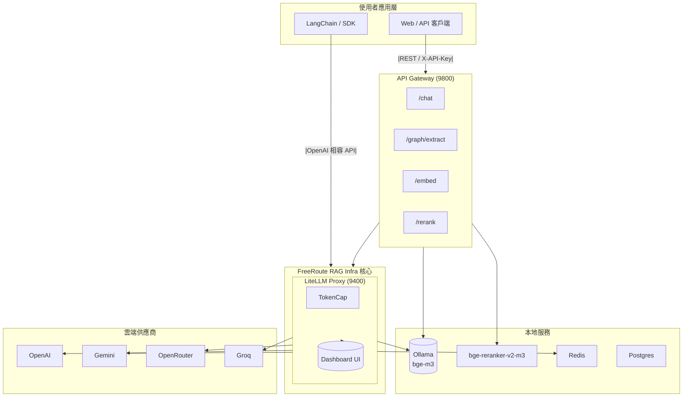

# FreeRoute RAG Infra

<div align="right">
  <sup>語言：</sup>
  <a href="README.md">English</a> |
  <a href="README.zh-TW.md">繁體中文</a>

</div>

**零成本 GraphRAG 基礎設施 — 生產就緒 & LangChain 相容**

完整的 **文檔 → 向量索引 → 知識圖譜 → 混合檢索** 管線，具備自動攝取、圖譜提取和智慧查詢規劃。

<!-- 徽章 -->
[](https://github.com/tc3oliver/FreeRoute-RAG-Infra/actions/workflows/ci.yml)
[](LICENSE)


## 概述

FreeRoute RAG Infra 是一套可本機部署的 RAG/GraphRAG 基礎設施，旨在幫助開發者以零成本構建和測試（Free-first 策略）。優先使用免費或低成本供應商，在配額用盡時自動回退，並包含本地元件。

特色功能：
快速開始（本機）

1) 建立 `.env` 檔案（範例）：

```bash
# .env（範例）
OPENAI_API_KEY=...
GOOGLE_API_KEY=...
OPENROUTER_API_KEY=...
GROQ_API_KEY=...
# 可選：API_GATEWAY_KEYS=dev-key,another-key
```

2) 使用 Docker Compose 啟動（建議）：

```bash
docker compose up -d --build
```

3) 健康檢查：

```bash
curl -s http://localhost:9400/health || curl -s http://localhost:9400/health/readiness | jq
curl -s http://localhost:9800/health | jq
```

4) Dashboard（LiteLLM UI）：

- URL: http://localhost:9400/ui
- 預設帳密：admin / admin123（請儘速修改）

注意事項：

- Ollama 會自動拉取 `bge-m3` 模型。Reranker 在首次執行時會下載 `BAAI/bge-reranker-v2-m3`，可能需數分鐘時間。
- 持久化儲存卷包括 `ollama_models` 和 `reranker_models`。

開發者快速啟動（使用 repo 的 .venv）：

```bash
# 建立 venv（若不存在）
python -m venv .venv
source .venv/bin/activate
# 安裝執行時與開發依賴
pip install -r services/gateway/requirements.txt
pip install -r requirements-dev.txt
```

本機執行 Gateway（供開發使用）：

```bash
# 在專案根目錄執行
PYTHONPATH=$(pwd) .venv/bin/uvicorn services.gateway.app:app --reload --port 9800
```

## 架構



備註：建議 LangChain 直接連接 LiteLLM (9400)。終端使用者的應用程式流程可通過 API Gateway (9800)。

## 功能特色

- OpenAI 相容 API (LiteLLM proxy)
- API Gateway: /chat、/embed、/rerank、/graph/extract
- 本地嵌入模型：Ollama bge-m3
- 本地重排序：BAAI/bge-reranker-v2-m3（可選 GPU）
- TokenCap：每日 OpenAI token 上限與成本感知路由
- Dashboard UI：請求、錯誤和使用情況監控

## 系統需求

- Docker 24+（Compose v2）
- 可選 GPU：NVIDIA 驅動程式 + Container Toolkit（建議 Linux CUDA 12.x）

## ✨ GraphRAG 功能

**完整的文檔到答案管線：**
- 📄 **文檔攝取**：自動掃描目錄、分塊與索引（Markdown、HTML、TXT）
- 🔍 **向量搜尋**：使用本地嵌入模型的語義相似性（Ollama bge-m3）
- 📊 **知識圖譜**：自動提取實體與關係，儲存至 Neo4j
- 🔀 **混合檢索**：結合向量 + 圖譜 + BM25 以獲得全面結果
- 🤖 **查詢規劃**：智慧路由與帶引用的答案生成
- 📈 **可觀測性**：度量、追蹤、速率限制、健康檢查

**基礎設施元件：**
- 🚀 **API Gateway** (9800)：統一 GraphRAG 端點，具備認證與速率限制
- 🧠 **LiteLLM Proxy** (9400)：多供應商 LLM 路由，具備 TokenCap 與回退機制
- 📚 **攝取服務** (9900)：批量文檔處理與知識提取
- 🗄️ **儲存層**：Qdrant（向量）+ Neo4j（圖譜）+ Redis（快取）+ Postgres（元數據）

## 快速開始

### 1. 環境設定

建立 `.env` 檔案：
```bash
# .env（必要）
OPENAI_API_KEY=sk-...
GOOGLE_API_KEY=AIza...
OPENROUTER_API_KEY=sk-or-...
GROQ_API_KEY=gsk_...

# 可選：自訂設定
API_GATEWAY_KEYS=dev-key,prod-key
NEO4J_PASSWORD=neo4j123
POSTGRES_PASSWORD=postgres123
CHUNK_SIZE=1000
```

### 2. 啟動所有服務

```bash
docker compose up -d --build
```

這將啟動：
- **LiteLLM Proxy** (9400) + Dashboard UI
- **API Gateway** (9800) 包含 GraphRAG 端點
- **攝取服務** (9900) 供文檔處理
- **Qdrant** (6333)、**Neo4j** (7474/7687)、**Redis** (6379)
- **Ollama** (9143) 提供本地嵌入模型
- **Reranker** (9080) 供結果重新排序

### 3. 健康檢查

```bash
curl -s http://localhost:9800/health | jq     # Gateway
curl -s http://localhost:9900/health | jq     # 攝取服務
curl -s http://localhost:9400/health | jq     # LiteLLM
curl -s http://localhost:6333/ | jq           # Qdrant
```

### 4. Dashboard 存取

**LiteLLM Dashboard**: http://localhost:9400/ui
- 使用者名稱：`admin` / 密碼：`admin123`（請儘速修改）
- 監控 API 使用量、成本和供應商狀態

**Neo4j Browser**: http://localhost:7474/
- 使用者名稱：`neo4j` / 密碼：`neo4j123`（或您的 `NEO4J_PASSWORD`）
- 視覺化探索知識圖譜

## 🚀 端到端 GraphRAG 使用

### 步驟 1：文檔攝取

```bash
# 建立範例文檔
mkdir -p data
echo "Alice Johnson 是台北 Acme Corporation 的資深軟體工程師。她專精於 Python、GraphRAG 和 AI 系統。" > data/alice.md

# 攝取文檔（自動分塊 + 嵌入 + 提取圖譜）
curl -X POST http://localhost:9900/ingest/directory \
  -H "Content-Type: application/json" \
  -d '{
    "path": "/data",
    "collection": "knowledge_base",
    "file_patterns": ["*.md", "*.txt"],
    "chunk_size": 800,
    "extract_graph": true,
    "force_reprocess": true
  }' | jq
```

### 步驟 2：混合搜尋與檢索

```bash
# 語義向量搜尋
curl -X POST http://localhost:9800/search \
  -H "X-API-Key: dev-key" \
  -H "Content-Type: application/json" \
  -d '{
    "query": "Python 工程師技能",
    "top_k": 3,
    "collection": "knowledge_base"
  }' | jq

# GraphRAG 混合檢索（向量 + 知識圖譜）
curl -X POST http://localhost:9800/retrieve \
  -H "X-API-Key: dev-key" \
  -H "Content-Type: application/json" \
  -d '{
    "query": "誰在 Acme Corporation 工作，他們有什麼技能？",
    "top_k": 5,
    "include_subgraph": true,
    "max_hops": 2
  }' | jq
```

### 步驟 3：知識圖譜查詢

```bash
# 直接圖譜查詢（Cypher）
curl -X POST http://localhost:9800/graph/query \
  -H "X-API-Key: dev-key" \
  -H "Content-Type: application/json" \
  -d '{
    "query": "MATCH (p:Person)-[r]-(c:Company) RETURN p.id, type(r), c.id LIMIT 10"
  }' | jq

# 手動圖譜更新
curl -X POST http://localhost:9800/graph/upsert \
  -H "X-API-Key: dev-key" \
  -H "Content-Type: application/json" \
  -d '{
    "data": {
      "nodes": [{"id": "Bob", "type": "Person", "props": [{"key": "role", "value": "Manager"}]}],
      "edges": [{"src": "Bob", "dst": "Acme Corporation", "type": "MANAGES", "props": []}]
    }
  }' | jq
```

### 步驟 4：CLI 工具（替代方式）

```bash
# 使用攝取服務 CLI 進行批量處理
cd services/ingestor
pip install -r requirements.txt

python cli.py ../../data \
  --collection mydata \
  --chunk-size 1000 \
  --ingestor-url http://localhost:9900
```

## 📖 完整 API 參考

### 攝取服務（埠 9900）

#### `POST /ingest/directory`
批量文檔攝取，具備自動分塊與圖譜提取功能。

**請求：**
```json
{
  "path": "/data",
  "collection": "chunks",
  "file_patterns": ["*.md", "*.txt", "*.html"],
  "chunk_size": 1000,
  "chunk_overlap": 200,
  "extract_graph": true,
  "force_reprocess": false
}
```

**回應：**
```json
{
  "ok": true,
  "message": "已處理 3/3 個檔案",
  "stats": {
    "files_found": 3,
    "files_processed": 3,
    "chunks_created": 12,
    "graphs_extracted": 3,
    "processing_time_sec": 45.2
  },
  "processed_files": ["doc1.md", "doc2.md"],
  "errors": []
}
```

### API Gateway（埠 9800）

#### `POST /index/chunks`
將文字區塊索引到向量資料庫。

**請求：**
```json
{
  "collection": "chunks",
  "chunks": [
    {
      "doc_id": "doc1",
      "text": "Alice 在 Acme Corp 工作...",
      "metadata": {"source": "document", "section": "bio"}
    }
  ]
}
```

#### `POST /search`
語義向量搜尋。

**請求：**
```json
{
  "query": "Python 工程師技能",
  "top_k": 5,
  "collection": "chunks",
  "filters": {"metadata.source": "resume"}
}
```

#### `POST /retrieve` ⭐
**GraphRAG 混合檢索** - 結合向量 + 圖譜搜尋的核心端點。

**請求：**
```json
{
  "query": "誰在 Acme 工作，他們有什麼技能？",
  "top_k": 5,
  "collection": "chunks",
  "include_subgraph": true,
  "max_hops": 2,
  "filters": null
}
```

**回應：**
```json
{
  "ok": true,
  "hits": [
    {
      "text": "Alice Johnson 是資深軟體工程師...",
      "metadata": {"doc_id": "alice.md"},
      "citations": [{"source": "vector", "doc_id": "alice.md", "score": 0.89}],
      "score": 0.89
    }
  ],
  "subgraph": {
    "nodes": [
      {"id": "Alice Johnson", "type": "Person", "props": {"role": "Engineer"}},
      {"id": "Acme Corporation", "type": "Company", "props": {"location": "Taipei"}}
    ],
    "edges": [
      {"src": "Alice Johnson", "dst": "Acme Corporation", "type": "WORKS_AT", "props": {}}
    ]
  },
  "query_time_ms": 150
}
```

#### `POST /graph/upsert`
插入/更新知識圖譜資料。

**請求：**
```json
{
  "data": {
    "nodes": [
      {"id": "Alice", "type": "Person", "props": [{"key": "role", "value": "Engineer"}]}
    ],
    "edges": [
      {"src": "Alice", "dst": "Acme", "type": "WORKS_AT", "props": []}
    ]
  }
}
```

#### `POST /graph/query`
在知識圖譜上執行 Cypher 查詢。

**請求：**
```json
{
  "query": "MATCH (p:Person)-[r]->(c:Company) RETURN p.id, type(r), c.id",
  "params": {"limit": 10}
}
```

#### 舊版端點
- `POST /chat` - 具備 JSON 模式支援的聊天完成
- `POST /embed` - 透過本地嵌入模型進行文字嵌入
- `POST /rerank` - 透過本地 bge-reranker 進行文字重新排序
- `POST /graph/extract` - 從文字內容提取知識圖譜

首次執行注意事項：

- Ollama 會自動拉取 bge-m3 模型。Reranker 在首次執行時會下載 BAAI/bge-reranker-v2-m3，可能需數分鐘時間。
- 持久化儲存卷：`ollama_models`、`reranker_models`。

## 設定

將設定放在 .env 中。請勿將 .env 提交至版本控制。

| 變數 | 範例 | 說明 |
| --- | --- | --- |
| LITELLM_MASTER_KEY | sk-admin | LiteLLM 統一 API 金鑰（供 LangChain/SDK） |
| OPENAI_API_KEY | sk-... | OpenAI API 金鑰（受每日 token 上限限制） |
| GOOGLE_API_KEY | AIza... | Google Gemini API 金鑰 |
| OPENROUTER_API_KEY | sk-or-... | OpenRouter API 金鑰 |
| GROQ_API_KEY | gsk_... | Groq API 金鑰 |
| OPENAI_TPD_LIMIT | 10000000 | 每日 OpenAI token 上限（例如 10M） |
| OPENAI_REROUTE_REAL | true | 即使直接呼叫真實 OpenAI 模型也允許重新路由 |
| GRAPH_SCHEMA_PATH | /app/schemas/graph_schema.json | 圖譜 Schema 路徑（TokenCap/Gateway 共用） |
| TZ | Asia/Taipei | 時區 |
| TZ_OFFSET_HOURS | 8 | Redis 每日計數器使用的時區偏移 |
| API_GATEWAY_KEYS | dev-key,another-key | Gateway 允許的 X-API-Key 清單 |
| NEO4J_PASSWORD | neo4j123 | Neo4j 資料庫密碼 |
| POSTGRES_PASSWORD | postgres123 | PostgreSQL 資料庫密碼 |
| CHUNK_SIZE | 1000 | 文檔處理的預設文字區塊大小 |
| CHUNK_OVERLAP | 200 | 文字區塊之間的重疊量 |

**GraphRAG 專用變數：**
- `QDRANT_URL`（預設 http://qdrant:6333）：向量資料庫連接
- `NEO4J_URI`（預設 bolt://neo4j:7687）：圖資料庫連接
- `GATEWAY_BASE`（預設 http://apigw:8000）：攝取服務 → Gateway 通訊
- `GATEWAY_API_KEY`（預設 dev-key）：攝取服務的 API 金鑰
- `GRAPH_SCHEMA_PATH`（預設 /app/schemas/graph_schema.json）：知識圖譜 schema
- `GRAPH_MIN_NODES/GRAPH_MIN_EDGES`（預設 1/1）：圖譜提取門檻
- `GRAPH_PROVIDER_CHAIN`：圖譜提取的 LLM 回退順序

成本保護：

- `litellm.config.yaml` 設定 `general_settings.max_budget_per_day: 0.0` 以避免意外成本。
- TokenCap 透過 `OPENAI_TPD_LIMIT` 執行每日 OpenAI token 限制；compose 預設為 9M（預留約 1M 給系統）。

## 🏗️ 架構與服務

### 服務概覽

| 服務 | 埠 | 說明 | 主要功能 |
|---------|------|-------------|--------------|
| **API Gateway** | 9800 | GraphRAG 統一 API | `/retrieve`、`/search`、`/index/chunks`、`/graph/*` |
| **攝取服務** | 9900 | 文檔處理 | 批量攝取、分塊、圖譜提取 |
| **LiteLLM Proxy** | 9400 | 多 LLM 路由器 + UI | TokenCap、回退、OpenAI 相容 |
| **Qdrant** | 6333 | 向量資料庫 | 語義搜尋、嵌入儲存 |
| **Neo4j** | 7474/7687 | 圖資料庫 | 知識圖譜、Cypher 查詢 |
| **Ollama** | 9143 | 本地嵌入 | bge-m3 模型、GPU 加速 |
| **Reranker** | 9080 | 結果重新排序 | bge-reranker-v2-m3、精度提升 |
| **Redis** | 6379 | 快取與計數器 | Token 限制、會話儲存 |
| **Postgres** | 5432 | 元資料儲存 | LiteLLM 設定、使用者資料 |

### 資料流

```
文檔 → [攝取服務] → 區塊 → [Qdrant] ← [API Gateway] ← 使用者查詢
              ↓                     ↑
         圖譜提取 → [Neo4j] ────┘
              ↓
          [LiteLLM] → 多個 LLM 供應商
```

## 免費額度與來源

供應商政策和配額會變更。請始終透過官方頁面進行驗證。

- OpenAI（API）
  - 沒有官方的「資料分享換取每日免費 token」計劃。預設情況下 API 呼叫不用於訓練（您可以選擇加入改進計劃）。
  - 免費額度取決於促銷活動、地區和時間。
  - 參考：
    - https://platform.openai.com/docs/billing/overview
    - https://platform.openai.com/docs/guides/rate-limits/usage-tiers

- Google Gemini
  - 透過 AI Studio/Developers 提供免費/試用配額；因模型和地區而異。
  - 參考：https://ai.google.dev/pricing

- Groq
  - 為特定模型（如 Llama/Mixtral 變體）提供免費推理 API，有速率和配額限制。
  - 參考：https://groq.com/pricing

- OpenRouter
  - 聚合眾多模型；某些標記為免費的模型有佇列/速率限制。
  - 參考：
    - https://openrouter.ai/pricing
    - https://openrouter.ai/models?tag=free

- Ollama（本地）
  - 本地推理，無雲端成本；效能取決於硬體。
  - 參考：https://ollama.com/

預設策略：優先使用免費或低成本供應商。當 OpenAI 達到每日 token 上限（TPD）或發生錯誤時，自動重新路由至 Gemini/Groq/OpenRouter。本地嵌入透過 Ollama。

## 模型入口點與路由

定義在 `configs/litellm.config.yaml` 中。

聊天/推理：

| 入口 | 後端 | 備註 |
| --- | --- | --- |
| rag-answer | OpenAI gpt-4o-mini | 預設；超量時重新路由 |
| rag-answer-gemini | Gemini 2.5 Flash | 免費回退 |
| rag-answer-openrouter | Mistral Small 24B（免費） | OpenRouter 回退 |
| rag-answer-groq | Groq Llama/Mixtral | 低延遲回退 |

圖譜提取：

| 入口 | 後端 | 備註 |
| --- | --- | --- |
| graph-extractor | OpenAI mini | 預設；TokenCap 注入 JSON Schema |
| graph-extractor-o1mini | OpenAI o1-mini | 回退 |
| graph-extractor-gemini | Gemini 2.5 Flash | 超量/失敗時優先回退 |

嵌入/重新排序：

| 入口 | 後端 | 備註 |
| --- | --- | --- |
| local-embed | Ollama bge-m3 | 本地、免費 |
| reranker（Gateway） | bge-reranker-v2-m3 | 自託管 API；使用 GPU 最佳 |

路由策略（TokenCap）：

- 每日計數器金鑰：`tpd:openai:YYYY-MM-DD`
- 多跳回退：
  - graph-extractor → graph-extractor-gemini
  - rag-answer → rag-answer-gemini → rag-answer-openrouter → rag-answer-groq
- OPENAI_REROUTE_REAL=true：即使呼叫真實 OpenAI 模型名稱也進行重新路由

## API

LiteLLM（統一 API）

- Base URL：`http://localhost:9400/v1`
- 認證：`Authorization: Bearer <LITELLM_MASTER_KEY>`

範例（Python / LangChain）：

```python
from langchain_openai import ChatOpenAI, OpenAIEmbeddings

llm = ChatOpenAI(base_url="http://localhost:9400/v1", api_key="sk-admin", model="rag-answer", temperature=0.2)
emb = OpenAIEmbeddings(base_url="http://localhost:9400/v1", api_key="sk-admin", model="local-embed")

print(llm.invoke("用三行解釋 RAG").content)
print(len(emb.embed_query("GraphRAG 與 RAG 的主要差異")))
```

OpenAI 相容 REST：

```bash
curl -s http://localhost:9400/v1/chat/completions \
  -H "Authorization: Bearer sk-admin" \
  -H "Content-Type: application/json" \
  -d '{"model":"rag-answer","messages":[{"role":"user","content":"列出 RAG 的三個優點"}]}'
```

API Gateway（應用層）

- Base：`http://localhost:9800`
- 認證：`X-API-Key: <key>`（預設 dev-key；透過 `API_GATEWAY_KEYS` 設定）

端點：

| 方法 | 路徑 | 用途 |
| --- | --- | --- |
| GET | /health | 健康檢查 |
| GET | /whoami | 設定摘要（需要金鑰） |
| POST | /chat | 聊天 / JSON 模式（自動系統提示） |
| POST | /embed | 嵌入（local-embed） |
| POST | /rerank | 文字重新排序（bge-reranker-v2-m3） |
| POST | /graph/extract | 具 Schema 驗證的圖譜提取 |

範例：

```bash
# /chat
curl -s -H "X-API-Key: dev-key" -H "Content-Type: application/json" \
  -d '{"messages":[{"role":"user","content":"用 JSON 回覆兩個要點的優點"}],"json_mode":true,"temperature":0.2}' \
  http://localhost:9800/chat | jq

# /embed
curl -s -H "X-API-Key: dev-key" -H "Content-Type: application/json" \
  -d '{"texts":["什麼是 RAG？","什麼是 GraphRAG？"]}' \
  http://localhost:9800/embed | jq

# /rerank
curl -s -H "X-API-Key: dev-key" -H "Content-Type: application/json" \
  -d '{"query":"什麼是生成式 AI？","documents":["AI 是人工智慧","生成式 AI 可以創建內容"],"top_n":2}' \
  http://localhost:9800/rerank | jq

# /graph/probe（輕量探測，無 schema 驗證）
curl -s -H "X-API-Key: dev-key" -H "Content-Type: application/json" \
  -d '{"model":"graph-extractor","strict_json":true}' \
  http://localhost:9800/graph/probe | jq
```

## Graph Schema

- 儲存庫路徑：`schemas/graph_schema.json`
- 容器路徑：`/app/schemas/graph_schema.json`（透過 docker-compose 掛載）
- 頂層結構：

```json
{
  "nodes": [
    {"id": "string", "type": "string", "props": [{"key": "...", "value": "..."}]}
  ],
  "edges": [
    {"src": "string", "dst": "string", "type": "string", "props": [{"key": "...", "value": "..."}]}
  ]
}
```

備註：`props[].value` 支援 string/number/boolean/null。

Gateway 與 TokenCap 讀取此檔案並在啟動時驗證（如無效則快速失敗）。

圖譜提取（建議透過 Gateway）：

```bash
curl -s -H "X-API-Key: dev-key" -H "Content-Type: application/json" \
  -d '{"context":"Alice 於 2022 年加入 Acme 擔任工程師；Acme 總部在台北，由 Bob 創立。"}' \
  http://localhost:9800/graph/extract | jq
```

常用參數：

- context（必要）
- min_nodes / min_edges（預設 1 / 1）
- allow_empty（預設 false）
- max_attempts（預設 2；每個供應商：嚴格然後引導）
- provider_chain（可選；覆蓋預設值）

## Reranker 與嵌入

嵌入（Ollama bge-m3）

- LiteLLM 模型名稱：`local-embed`
- 在 LangChain 中，使用 `OpenAIEmbeddings` 指向 LiteLLM base URL

Reranker（bge-reranker-v2-m3）

-- 直接端點：`POST http://localhost:9080/rerank`
-- 透過 Gateway：`POST http://localhost:9800/rerank`
- 回應：`{"ok": true, "results": [{"index": 1, "score": 0.83, "text": "..."}]}`

## 🧪 測試與驗證

### 快速驗證

```bash
# 測試文檔攝取管線
curl -X POST http://localhost:9900/ingest/directory \
  -H "Content-Type: application/json" \
  -d '{"path": "/data", "extract_graph": true}' | jq

# 測試 GraphRAG 混合檢索
curl -X POST http://localhost:9800/retrieve \
  -H "X-API-Key: dev-key" \
  -H "Content-Type: application/json" \
  -d '{"query": "工程師技能", "include_subgraph": true}' | jq

# 驗證知識圖譜
curl -X POST http://localhost:9800/graph/query \
  -H "X-API-Key: dev-key" \
  -H "Content-Type: application/json" \
  -d '{"query": "MATCH (n) RETURN count(n) as total_nodes"}' | jq
```

### 全面測試

**單元測試**（快速，無外部服務）：
```bash
PYTHONPATH=$(pwd) .venv/bin/pytest -q tests/unit
```

**整合測試**（需要執行中的服務）：
```bash
docker compose up -d --build
PYTHONPATH=$(pwd) .venv/bin/pytest -q tests/integration
```

**效能基準測試：**
```bash
# 批量攝取測試
python services/ingestor/cli.py ./data --chunk-size 500 --no-graph

# 查詢延遲測試
for i in {1..10}; do
  curl -w "@curl-format.txt" -X POST http://localhost:9800/retrieve \
    -H "X-API-Key: dev-key" -d '{"query": "測試查詢"}'
done
```

### 度量（Prometheus）
API Gateway 在安裝 `prometheus-client` 套件時提供可選的 `/metrics` 端點。

在本地或 CI 中安裝以啟用抓取：

```bash
pip install prometheus-client
```

行為：
- 安裝 `prometheus-client` 時，`/metrics` 回傳 Prometheus 格式的度量。Gateway 收集每個端點的請求計數和請求持續時間。
- 未安裝時，`/metrics` 回傳 HTTP 204，因此在最小部署中探測仍然安全。

Prometheus 抓取的快速範例（Prometheus `scrape_configs`）：

```yaml
- job_name: 'free-rag-gateway'
  static_configs:
    - targets: ['host.docker.internal:9800']
      labels:
        service: gateway
```

備註：
- Gateway 使用模組本地 CollectorRegistry 以避免在測試或解釋器重啟期間重複註冊。
- 您可以在 CI 中透過在測試步驟安裝 `prometheus-client` 來啟用度量。

## 開發者設定與 pre-commit（簡短）

我們建議在本地安裝開發和測試依賴以加速開發，並避免 pre-commit hooks 在首次執行時下載大量套件：

```bash
# 安裝開發依賴（在開發機上執行一次）
pip install -r requirements-dev.txt

# 安裝 pre-commit hooks（在 .git/hooks 中註冊 hooks）
pip install pre-commit
pre-commit install
```

備註：在機器上首次執行時，pre-commit hook 的隔離 venv 可能會下載 `requirements-dev.txt` 中列出的套件，這會使該次 commit 較慢。要暫時跳過 hooks，使用 `git commit --no-verify`（謹慎使用）。

如果在每次 commit 時執行完整測試套件對您的工作流程太慢，考慮在推送時執行測試或設定 pre-commit hook 執行較小的檢查子集。

## 🔧 疑難排解

### 常見問題

**服務無法啟動：**
```bash
# 檢查服務狀態
docker compose ps
docker compose logs <service_name>

# 修正：平台相容性（M1 Mac / ARM）
export PLATFORM=linux/amd64
docker compose up -d --build
```

**圖譜提取逾時：**
```bash
# 檢查 LiteLLM API 健康狀況
curl http://localhost:9400/health

# 為圖譜提取減少文檔大小
curl -X POST http://localhost:9900/ingest/directory \
  -d '{"path": "/data", "chunk_size": 500, "extract_graph": false}'
```

**搜尋結果為空：**
```bash
# 驗證嵌入模型就緒
curl http://localhost:9143/api/ps

# 檢查向量資料庫
curl http://localhost:6333/collections

# 如需要，重新索引
curl -X POST http://localhost:9900/ingest/directory \
  -d '{"path": "/data", "force_reprocess": true}'
```

**圖譜查詢失敗：**
```bash
# 檢查 Neo4j 連線
curl http://localhost:7474/
# 瀏覽器：http://localhost:7474/ (neo4j/neo4j123)

# 驗證圖譜資料存在
curl -X POST http://localhost:9800/graph/query \
  -H "X-API-Key: dev-key" \
  -d '{"query": "MATCH (n) RETURN count(n)"}'
```

**效能問題：**
- **攝取緩慢**：減少 `chunk_size`，為大文檔停用 `extract_graph`
- **記憶體使用量高**：限制並發處理，增加 Docker 記憶體分配
- **未使用 GPU**：安裝 NVIDIA Container Toolkit，在容器中驗證 `nvidia-smi`

### 日誌分析

```bash
# 檢查所有服務日誌
docker compose logs --tail=50

# 專注於特定服務
docker compose logs ingestor apigw litellm qdrant neo4j

# 即時監控
docker compose logs -f ingestor
```

## 專案結構

```
.
├─ services/
│  ├─ gateway/               # API Gateway（FastAPI）
│  │  ├─ app.py
│  │  └─ requirements.txt
│  └─ reranker/              # PyTorch Reranker（FastAPI）
│     └─ server.py
├─ integrations/
│  └─ litellm/
│     └─ plugins/
│        └─ token_cap.py     # TokenCap：TPD + 重新路由 + schema 注入
├─ containers/
│  ├─ gateway/Dockerfile     # Gateway 容器
│  └─ litellm/Dockerfile     # LiteLLM 容器
├─ schemas/
│  └─ graph_schema.json      # Graph JSON Schema（掛載至 /app/schemas）
├─ configs/
│  └─ litellm.config.yaml    # LiteLLM 模型與路由策略
├─ tests/
│  ├─ unit/                      # 快速單元測試（CI 預設）
│  │  ├─ test_gateway_handlers.py
│  │  └─ test_tokencap.py
│  ├─ integration/               # 對執行中服務的端到端煙霧測試
│  │  └─ test_gateway_smoke.py
│  └─ reranker/
│     └─ test_reranker.py
├─ docker-compose.yml        # 一鍵部署
├─ pyproject.toml
├─ README.md / README.zh-TW.md
└─ ...
```

## 🤝 貢獻

歡迎貢獻！請參見 [CONTRIBUTING.md](CONTRIBUTING.md) 了解指導原則。

### 開發設定

```bash
# 複製與設定
git clone https://github.com/tc3oliver/FreeRoute-RAG-Infra.git
cd FreeRoute-RAG-Infra

# 安裝開發依賴
pip install -r requirements-dev.txt
pre-commit install

# 執行測試
PYTHONPATH=$(pwd) pytest tests/unit/
```

### 🆘 支援

- 📖 **文件**：此 README 提供完整使用指南
- 🐛 **問題**：[GitHub Issues](https://github.com/tc3oliver/FreeRoute-RAG-Infra/issues)
- 💬 **討論**：[GitHub Discussions](https://github.com/tc3oliver/FreeRoute-RAG-Infra/discussions)
- 🔄 **更新**：為儲存庫加星並關注以獲得最新功能

## 📄 授權

MIT License - 詳見 [LICENSE](LICENSE)。

**自由且開源** - 以零成本構建生產級 GraphRAG 基礎設施！🚀
