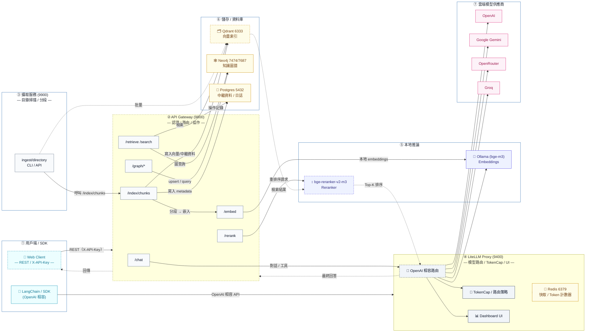

# FreeRoute RAG Infra

<div align="right">
  <sup>語言：</sup>
  <a href="README.md">English</a> |
  <a href="README.zh-TW.md"><b>繁體中文</b></a>
</div>

**零成本 GraphRAG 基礎設施 — 生產就緒、可與 LangChain 相容**

端到端 **文件 → 向量索引 → 知識圖譜 → 混合檢索**，支援自動攝取、圖譜抽取，以及依成本/配額自動切換多供應商路由。

<!-- 徽章 -->

[](https://github.com/tc3oliver/FreeRoute-RAG-Infra/actions/workflows/ci.yml)
[](LICENSE)


---

## 概述

FreeRoute RAG Infra 可在本機部署，協助你以**極低成本（近零成本）**打造 RAG/GraphRAG 系統。優先使用免費或低成本供應商；當觸發配額或錯誤時自動回退；同時提供本地嵌入與重排序元件。

**重點特色**

* 一行指令快速啟動（Docker Compose）
* OpenAI 相容 Proxy（LiteLLM）供 LangChain / SDK 直接使用
* 混合檢索：向量 + 知識圖譜（可選 rerank）
* TokenCap：每日 OpenAI token 上限，依使用情境智慧回退
* 本地推論：Ollama bge-m3（embeddings）、BAAI bge-reranker-v2-m3（rerank）
* 可觀測性：健康檢查、選配 Prometheus metrics、可視化儀表板

---

## 快速開始（本機）

1. 建立 `.env`：

```bash
# .env（範例）
OPENAI_API_KEY=...
GOOGLE_API_KEY=...
OPENROUTER_API_KEY=...
GROQ_API_KEY=...
# 可選：
API_GATEWAY_KEYS=dev-key,another-key
NEO4J_PASSWORD=neo4j123
POSTGRES_PASSWORD=postgres123
```

2. 啟動全部服務：

```bash
docker compose up -d --build
```

3. 健康檢查：

```bash
# LiteLLM proxy
curl -s http://localhost:9400/health | jq || \
curl -s http://localhost:9400/health/readiness | jq

# Gateway / Ingestor
curl -s http://localhost:9800/health | jq
curl -s http://localhost:9900/health | jq
```

4. 儀表板（LiteLLM UI）

* URL：[http://localhost:9400/ui](http://localhost:9400/ui)
* 預設帳密：`admin` / `admin123` → **請儘速修改**

**備註**

* Ollama 會自動拉取 **`bge-m3`**。
* Reranker 首次啟動會下載 **`BAAI/bge-reranker-v2-m3`**（需數分鐘）。
* Compose 以 `ollama_models`、`reranker_models` 等 volume 持久化模型。

---

## 開發者快速開始

```bash
# 建立並啟用虛擬環境
python -m venv .venv
source .venv/bin/activate

# 安裝執行與開發依賴
pip install -r services/gateway/requirements.txt
pip install -r requirements-dev.txt
```

本地啟動 **Gateway**：

```bash
uvicorn services.gateway.app:app --host 0.0.0.0 --port 9800 --reload
```

本地啟動 **Reranker**（可選）：

```bash
uvicorn services.reranker.server:app --host 0.0.0.0 --port 9080 --reload
```

---

## 架構



> 提示：**LangChain 建議直連 LiteLLM**（埠 **9400**）；終端應用流程走 **API Gateway**（埠 **9800**）。

---

## 功能特色

* **OpenAI 相容 API**（LiteLLM proxy + 儀表板）
* **API Gateway**：`/chat`、`/embed`、`/rerank`、`/graph/*`
* **本地嵌入**：Ollama **bge-m3**
* **本地重排序**：**BAAI/bge-reranker-v2-m3**（可選 GPU）
* **TokenCap**：每日 OpenAI token 上限 + 用量感知回退
* **可觀測性**：健康端點，選配 Prometheus `/metrics`

## 系統需求

* Docker 24+（Compose v2）
* 可選 GPU：NVIDIA 驅動 + Container Toolkit（建議 Linux / CUDA 12.x）

---

## ✨ GraphRAG 能力

**從文件到回答的完整流程**

* 📄 **文件攝取**：自動掃描資料夾、分塊與索引（Markdown/HTML/TXT）
* 🔍 **向量搜尋**：透過 Ollama（bge-m3）產生本地 embeddings
* 🕸 **知識圖譜**：自動抽取實體/關係，儲存至 Neo4j
* 🔀 **混合檢索**：向量 + 圖譜（可再加 BM25）
* 🤖 **查詢規劃**：多供應商路由與具引用的回答
* 📈 **可觀測性**：metrics、tracing、限流、健康檢查

**基礎設施元件**

* 🚀 **API Gateway**（9800）：統一端點、認證與協作
* 🧠 **LiteLLM Proxy**（9400）：多供應商路由、TokenCap、回退鏈
* 📚 **攝取服務**（9900）：批量處理與圖譜抽取
* 🗄️ **儲存層**：Qdrant（向量）+ Neo4j（圖）+ Redis（計數/快取）+ Postgres（中繼資料）

---

## 端到端使用（CLI & cURL）

### 步驟 1 — 攝取文件

```bash
mkdir -p data
echo "Alice Johnson 是台北 Acme Corporation 的資深軟體工程師，專長 Python、GraphRAG 與 AI 系統。" > data/alice.md

curl -X POST http://localhost:9900/ingest/directory \
  -H "Content-Type: application/json" \
  -d '{
    "path": "/data",
    "collection": "knowledge_base",
    "file_patterns": ["*.md", "*.txt"],
    "chunk_size": 800,
    "extract_graph": true,
    "force_reprocess": true
  }' | jq
```

### 步驟 2 — 混合檢索

```bash
# 向量搜尋
curl -X POST http://localhost:9800/search \
  -H "X-API-Key: dev-key" -H "Content-Type: application/json" \
  -d '{"query":"Python 工程師技能","top_k":3,"collection":"knowledge_base"}' | jq

# GraphRAG（向量 + 子圖）
curl -X POST http://localhost:9800/retrieve \
  -H "X-API-Key: dev-key" -H "Content-Type: application/json" \
  -d '{"query":"誰在 Acme Corporation 工作？他們擅長什麼？","top_k":5,"include_subgraph":true,"max_hops":2}' | jq
```

### 步驟 3 — 圖譜查詢

```bash
# Cypher（唯讀）
curl -X POST http://localhost:9800/graph/query \
  -H "X-API-Key: dev-key" -H "Content-Type: application/json" \
  -d '{"query":"MATCH (p:Person)-[r]-(c:Company) RETURN p.id, type(r), c.id LIMIT 10"}' | jq

# 手動 upsert
curl -X POST http://localhost:9800/graph/upsert \
  -H "X-API-Key: dev-key" -H "Content-Type: application/json" \
  -d '{
    "data": {
      "nodes": [{"id":"Bob","type":"Person","props":[{"key":"role","value":"Manager"}]}],
      "edges": [{"src":"Bob","dst":"Acme Corporation","type":"MANAGES","props":[]}]
    }
  }' | jq
```

### 步驟 4 — Ingestor CLI（替代方案）

```bash
cd services/ingestor
pip install -r requirements.txt

python cli.py ../../data \
  --collection mydata \
  --chunk-size 1000 \
  --ingestor-url http://localhost:9900
```

---

## 完整 API 參考

**最新定義**（端點、請求/回應結構、可用模型）請見：

* `docs/zh/api_usage.md`（繁體中文）
* `docs/en/api_usage.md`（英文）

> 如發現文件與實際行為不同，請直接比對你目前分支與 `main`，或呼叫執行中服務的 `/health`、`/whoami`。

---

## 設定（.env）

> 機密請放 `.env`，**不要**提交到版本庫。

| 變數                    | 範例                               | 說明                                |
| --------------------- | -------------------------------- | --------------------------------- |
| `LITELLM_MASTER_KEY`  | `sk-admin`                       | 提供給 LangChain/SDK 的 LiteLLM 金鑰    |
| `LITELLM_KEY`         | `sk-admin`                       | Gateway 呼叫 LiteLLM 的內部金鑰          |
| `OPENAI_API_KEY`      | `sk-...`                         | OpenAI API 金鑰（受每日 token 上限）       |
| `GOOGLE_API_KEY`      | `AIza...`                        | Google Gemini API 金鑰              |
| `OPENROUTER_API_KEY`  | `sk-or-...`                      | OpenRouter API 金鑰                 |
| `GROQ_API_KEY`        | `gsk_...`                        | Groq API 金鑰                       |
| `OPENAI_TPD_LIMIT`    | `10000000`                       | 每日 OpenAI token 上限（例：10M）         |
| `OPENAI_REROUTE_REAL` | `true`                           | 即便直接呼叫 OpenAI 也允許回退               |
| `GRAPH_SCHEMA_PATH`   | `/app/schemas/graph_schema.json` | 圖譜 schema 路徑（TokenCap/Gateway 共用） |
| `TZ`                  | `Asia/Taipei`                    | 時區                                |
| `TZ_OFFSET_HOURS`     | `8`                              | Redis 每日計數器的時區偏移                  |
| `API_GATEWAY_KEYS`    | `dev-key,another-key`            | Gateway 允許的 X-API-Key 清單          |
| `NEO4J_PASSWORD`      | `neo4j123`                       | Neo4j 密碼                          |
| `POSTGRES_PASSWORD`   | `postgres123`                    | Postgres 密碼                       |
| `CHUNK_SIZE`          | `1000`                           | 預設文字分塊大小                          |
| `CHUNK_OVERLAP`       | `200`                            | 分塊重疊字數                            |

**GraphRAG 相關**

* `QDRANT_URL`（預設 `http://qdrant:6333`）— 向量資料庫
* `NEO4J_URI`（預設 `bolt://neo4j:7687`）— 圖資料庫
* `GATEWAY_BASE`（預設 `http://apigw:8000`）— Ingestor → Gateway
* `GATEWAY_API_KEY`（預設 `dev-key`）— Ingestor 呼叫 Gateway 的金鑰
* `GRAPH_MIN_NODES` / `GRAPH_MIN_EDGES`（預設 `1/1`）
* `GRAPH_PROVIDER_CHAIN` — 圖譜抽取的供應商回退順序

**成本保護**

* `litellm.config.yaml` 中 `general_settings.max_budget_per_day: 0.0` 可避免意外支出
* TokenCap 依 `OPENAI_TPD_LIMIT` 控制日用量；Compose 預設較高，預留系統使用空間

---

## 模型入口與路由

**別名（摘要）**

**聊天 / 推理**

| 別名                      | 後端                                               | 用途          | 回退順序 |
| ----------------------- | ------------------------------------------------ | ----------- | ---- |
| `rag-answer`            | `openai/gpt-5-mini-2025-08-07`                   | 主力 Chat/RAG | 1    |
| `rag-answer-gemini`     | `gemini/2.5-flash`                               | 免費/低成本      | 2    |
| `rag-answer-openrouter` | `openrouter/mistral-small-3.2-24b-instruct:free` | 社群/免費       | 3    |
| `rag-answer-groq`       | `groq/llama-3.1-8b-instant`                      | 低延遲         | 4    |

**圖譜抽取**

| 別名                       | 後端                             | 備註                  |
| ------------------------ | ------------------------------ | ------------------- |
| `graph-extractor`        | `openai/gpt-5-mini-2025-08-07` | 注入 JSON schema、溫度 0 |
| `graph-extractor-o1mini` | `openai/o1-mini-2024-09-12`    | 中繼重試                |
| `graph-extractor-gemini` | `gemini/2.5-flash`             | 尾端回退                |

**嵌入 / 重排序**

| 別名                     | 後端                   | 備註            |
| ---------------------- | -------------------- | ------------- |
| `local-embed`          | `ollama/bge-m3`      | 本地 embeddings |
| `reranker`（透過 Gateway） | `bge-reranker-v2-m3` | 自託管重排序        |

**路由重點**

* 策略：`usage_aware_fallback` + **TokenCap**（OpenAI 日額度）
* Redis 計數 key：`tpd:openai:YYYY-MM-DD`
* 回退鏈：

  * `rag-answer` → `rag-answer-gemini` → `rag-answer-openrouter` → `rag-answer-groq`
  * `graph-extractor` → `graph-extractor-o1mini` → `graph-extractor-o1mini` → `graph-extractor-gemini`
* `OPENAI_REROUTE_REAL=true`：即使直接用 OpenAI 原名也會在超額時回退
* 對外建議配發 `LITELLM_MASTER_KEY`；Gateway 內部呼叫使用 `LITELLM_KEY`

---

## API（快速範例）

**LiteLLM（OpenAI 相容）— Base：`http://localhost:9400/v1`**

Python（LangChain）：

```python
from langchain_openai import ChatOpenAI, OpenAIEmbeddings

llm = ChatOpenAI(base_url="http://localhost:9400/v1", api_key="sk-admin",
                 model="rag-answer", temperature=0.2)
emb = OpenAIEmbeddings(base_url="http://localhost:9400/v1", api_key="sk-admin",
                       model="local-embed")

print(llm.invoke("用三行解釋 RAG").content)
print(len(emb.embed_query("GraphRAG 與 RAG 的差異")))
```

cURL：

```bash
curl -s http://localhost:9400/v1/chat/completions \
  -H "Authorization: Bearer sk-admin" -H "Content-Type: application/json" \
  -d '{"model":"rag-answer","messages":[{"role":"user","content":"列出 RAG 的三個優點"}]}'
```

**API Gateway — Base：`http://localhost:9800`（X-API-Key）**

```bash
# /chat（JSON 模式）
curl -s -H "X-API-Key: dev-key" -H "Content-Type: application/json" \
  -d '{"messages":[{"role":"user","content":"請用 JSON 回兩個要點"}],"json_mode":true,"temperature":0.2}' \
  http://localhost:9800/chat | jq

# /embed
curl -s -H "X-API-Key: dev-key" -H "Content-Type: application/json" \
  -d '{"texts":["什麼是 RAG？","什麼是 GraphRAG？"]}' \
  http://localhost:9800/embed | jq

# /rerank
curl -s -H "X-API-Key: dev-key" -H "Content-Type: application/json" \
  -d '{"query":"什麼是生成式 AI？","documents":["AI 是人工智慧","生成式 AI 可以創建內容"],"top_n":2}' \
  http://localhost:9800/rerank | jq

# /graph/probe（嚴格 JSON）
curl -s -H "X-API-Key: dev-key" -H "Content-Type: application/json" \
  -d '{"model":"graph-extractor","strict_json":true}' \
  http://localhost:9800/graph/probe | jq
```

---

## Graph Schema

* **儲存庫**：`schemas/graph_schema.json`
* **容器內**：`/app/schemas/graph_schema.json`（由 Compose 掛載）

頂層結構：

```json
{
  "nodes": [
    {"id": "string", "type": "string", "props": [{"key": "...", "value": "..."}]}
  ],
  "edges": [
    {"src": "string", "dst": "string", "type": "string", "props": [{"key": "...", "value": "..."}]}
  ]
}
```

* `props[].value` 支援 string / number / boolean / null
* Gateway 與 TokenCap 啟動時會讀取並驗證（不合法時快速失敗）

圖譜抽取（透過 Gateway）：

```bash
curl -s -H "X-API-Key: dev-key" -H "Content-Type: application/json" \
  -d '{"context":"Alice 於 2022 年加入 Acme 擔任工程師；Acme 總部在台北，由 Bob 創立。"}' \
  http://localhost:9800/graph/extract | jq
```

---

## Reranker 與 Embeddings

* **Embeddings**：LiteLLM 別名 `local-embed` → Ollama **bge-m3**
* **Reranker**：BAAI **bge-reranker-v2-m3**

  * 直連：`POST http://localhost:9080/rerank`
  * Gateway：`POST http://localhost:9800/rerank`
  * 回應形狀：`{"ok": true, "results": [{"index": 1, "score": 0.83, "text": "..."}]}`

---

## 測試與驗證

**快速驗證**

```bash
# 攝取
curl -X POST http://localhost:9900/ingest/directory \
  -H "Content-Type: application/json" \
  -d '{"path":"/data","extract_graph":true}' | jq

# 混合檢索
curl -X POST http://localhost:9800/retrieve \
  -H "X-API-Key: dev-key" -H "Content-Type: application/json" \
  -d '{"query":"工程師技能","include_subgraph":true}' | jq

# 圖譜數量
curl -X POST http://localhost:9800/graph/query \
  -H "X-API-Key: dev-key" -H "Content-Type: application/json" \
  -d '{"query":"MATCH (n) RETURN count(n) as total_nodes"}' | jq
```

**單元測試**（不依賴外部服務）：

```bash
PYTHONPATH=$(pwd) .venv/bin/pytest -q tests/unit
```

**整合測試**（需服務運行）：

```bash
docker compose up -d --build
PYTHONPATH=$(pwd) .venv/bin/pytest -q tests/integration
```

**基準測試**

```bash
# 批量攝取
python services/ingestor/cli.py ./data --chunk-size 500 --no-graph

# 查詢延遲
for i in {1..10}; do
  curl -w "@curl-format.txt" -X POST http://localhost:9800/retrieve \
    -H "X-API-Key: dev-key" -d '{"query":"測試查詢"}'
done
```

---

## Metrics（Prometheus）

Gateway 僅在安裝 `prometheus-client` 後才提供 `/metrics`：

```bash
pip install prometheus-client
```

* 若已安裝：`/metrics` 回傳 Prometheus 格式（每端點請求計數與延遲）
* 若未安裝：`/metrics` 回傳 **204**（避免在最小部署時出錯）

Prometheus 抓取設定：

```yaml
- job_name: 'free-rag-gateway'
  static_configs:
    - targets: ['host.docker.internal:9800']
      labels:
        service: gateway
```

---

## 疑難排解

**服務啟不動**

```bash
docker compose ps
docker compose logs <service>
# M1/ARM
export PLATFORM=linux/amd64
docker compose up -d --build
```

**圖譜抽取逾時**

```bash
curl http://localhost:9400/health
curl -X POST http://localhost:9900/ingest/directory \
  -d '{"path":"/data","chunk_size":500,"extract_graph":false}'
```

**搜尋為空**

```bash
curl http://localhost:9143/api/ps         # Ollama
curl http://localhost:6333/collections    # Qdrant
# 重新索引
curl -X POST http://localhost:9900/ingest/directory \
  -d '{"path":"/data","force_reprocess":true}'
```

**圖查詢錯誤**

```bash
curl http://localhost:7474/
curl -X POST http://localhost:9800/graph/query \
  -H "X-API-Key: dev-key" \
  -d '{"query":"MATCH (n) RETURN count(n)"}'
```

**效能建議**

* 攝取慢 → 降低 `chunk_size`，大型文件可先關 `extract_graph`
* 記憶體高 → 限制並發、提高 Docker 記憶體
* GPU 未啟用 → 安裝 NVIDIA Container Toolkit，容器內用 `nvidia-smi` 檢查

**限流 / 回退觸發**

症狀：HTTP 429、回應中模型別名改變（fallback）、在達額後延遲短暫增加。

檢查：

```bash
docker compose logs litellm | grep -i reroute | tail -20
grep OPENAI_TPD_LIMIT docker-compose.yml .env || echo "not set"
docker exec -it redis redis-cli KEYS tpd:openai:* | head
grep -n "fallbacks:" configs/litellm.config.yaml
```

行動：

* 調高 `OPENAI_TPD_LIMIT` 或降流量
* 加入更多免費/低成本回退（如 OpenRouter）
* 確保 Redis 健康（TokenCap 依賴計數）
* 設 `OPENAI_REROUTE_REAL=false`：遇到 OpenAI 原生模型失敗時改為快速失敗
* 透過 LiteLLM Dashboard（`/ui`）觀測

---

## 專案結構

```
.
├─ services/
│  ├─ gateway/               # API Gateway（FastAPI）
│  │  ├─ app.py
│  │  └─ requirements.txt
│  └─ reranker/              # PyTorch Reranker（FastAPI）
│     └─ server.py
├─ integrations/
│  └─ litellm/
│     └─ plugins/
│        └─ token_cap.py     # TokenCap：TPD + 回退 + schema 注入
├─ containers/
│  ├─ gateway/Dockerfile
│  └─ litellm/Dockerfile
├─ schemas/
│  └─ graph_schema.json
├─ configs/
│  └─ litellm.config.yaml
├─ tests/
│  ├─ unit/
│  ├─ integration/
│  └─ reranker/
├─ docker-compose.yml
├─ pyproject.toml
├─ README.md / README.zh-TW.md
└─ ...
```

---

## 貢獻

歡迎 PR！請參考 [CONTRIBUTING.md](CONTRIBUTING.md)。

快速開發配置：

```bash
pip install -r requirements-dev.txt
pre-commit install
PYTHONPATH=$(pwd) pytest tests/unit/
```

## 支援

* 📖 文件：README + `docs/zh/api_usage.md`
* 🐛 回報：GitHub Issues
* 💬 討論：GitHub Discussions
* 🔄 更新：替本專案加星與追蹤

## 授權

MIT — 見 [LICENSE](LICENSE)。

**自由開源** — 以零成本打造生產級 GraphRAG 基礎設施！🚀
